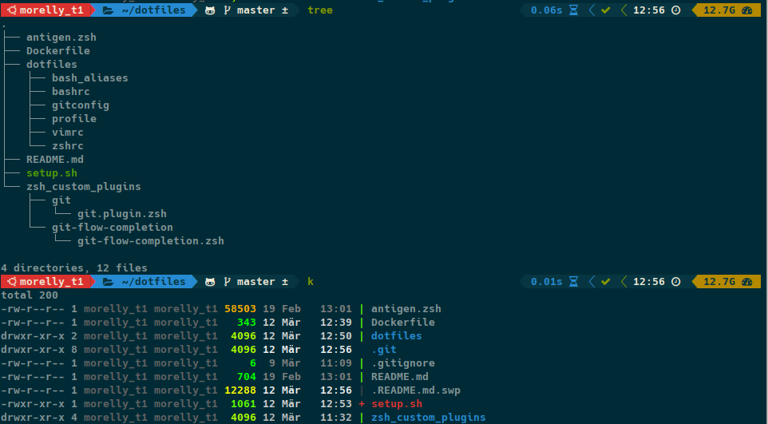

# My Dotfiles for Ubuntu < 18.04


inspired by [@daniruiz](https://github.com/daniruiz/dotfiles)
## Features
* [ssh-connect](https://github.com/gko/ssh-connect)
* [k](https://github.com/supercrabtree/k) 
* [alias-tips](https://github.com/djui/alias-tips) 
* [zsh-tab-title](https://github.com/trystan2k/zsh-tab-title) 
* [zsh-syntax-highlight](https://github.com/zsh-users/zsh-syntax-highlighting) 
* [zsh-autosuggestions](https://github.com/zsh-users/zsh-autosuggestions) 
* colored-man-pages
* [auto-ls](https://github.com/desyncr/auto-ls) 
*  many other ..

## Usage
```
cd ~
git clone https://github.com/FalcoSuessgott/dotfiles.git
cd dotfiles
bash setup.sh
```
## Preview in Docker
```
cd ~
git clone https://github.com/FalcoSuessgott/dotfiles.git
cd dotfiles
docker build -t dotfiles .
docker run -it --entrypoint zsh dotfiles
```
