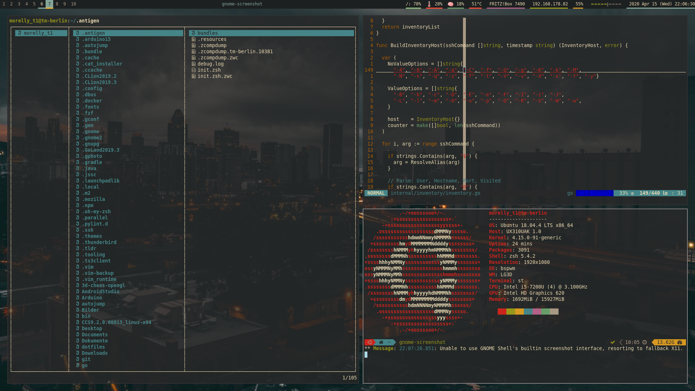

# My Dotfiles for Ubuntu < 18.04


## Feature / Tools
* vim
* zsh (+antigen)
* bspwm
* st
* sxhkdrc
* bash
* git
* lf
* polybar

# Usage

## Debs (still collecting )
```
sudo apt-get install git vim zsh xcb libxcb-util0-dev libxcb-ewmh-dev libxcb-randr0-dev libxcb-icccm4-dev libxcb-keysyms1-dev libxcb-xinerama0-dev libasound2-dev libxcb-xtest0-dev libxcb-shape0-dev
curl -L git.io/antigen > antigen.zsh
```

## Repos (still collecting)
```
mkdir ~/git
cd /git
git clone https://github.com/baskerville/bspwm.git && cd bspwm && make && sudo make install
git clone https://github.com/baskerville/sxhkd.git && cd sxhkd && make && sudo make install
git clone https://github.com/LukeSmithxyz/st.git && cd st && make && sudo make install
git clone https://github.com/polybar/polybar.git && cd polybar && make && sudo make install
```

## Link dotfiles
```
bash link.sh
```
