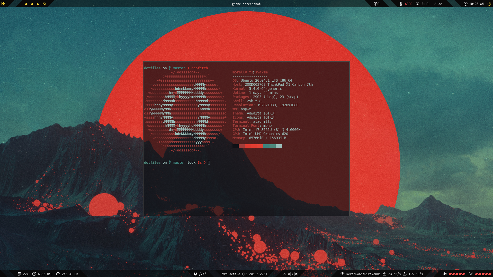

# My Dotfiles for Ubuntu (18.04, 19.04, 20.04)



# Overview
| Topic           | Tool      |
|-----------------|-----------|
| Terminal        | alacritty |
| Windowmanager   | bspwm     |
| Shortcutmanager | sxhkdrc   |
| Statusbar       | polybar   |
| Filemanager     | lf        |
| Shell           | zsh       |
| Editor          | Vim       |

## Features
* change wallpaper and adjust the terminals acoording its colors
* ...

```


## Link dotfiles
```
bash link.sh
```
